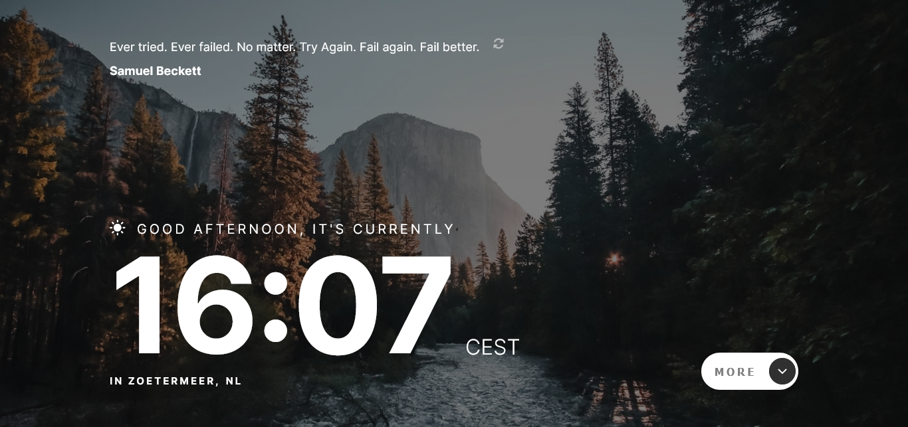

# Frontend Mentor - Clock app solution

This is a solution to the [Clock app challenge on Frontend Mentor](https://www.frontendmentor.io/challenges/clock-app-LMFaxFwrM). Frontend Mentor challenges help you improve your coding skills by building realistic projects. 

## Table of contents

- [Frontend Mentor - Clock app solution](#frontend-mentor---clock-app-solution)
  - [Table of contents](#table-of-contents)
  - [Overview](#overview)
    - [The challenge](#the-challenge)
    - [Screenshot](#screenshot)
    - [Links](#links)
  - [My process](#my-process)
    - [Built with](#built-with)
    - [Useful resources](#useful-resources)
  - [Author](#author)

## Overview

### The challenge

Users should be able to:

- View the optimal layout for the site depending on their device's screen size
- See hover states for all interactive elements on the page
- View the current time and location information based on their IP address
- View additional information about the date and time in the expanded state
- Be shown the correct greeting and background image based on the time of day they're visiting the site
- Generate random programming quotes by clicking the refresh icon near the quote

### Screenshot

### Links

- Solution URL: (https://github.com/Gzeven/clock-app)
- Live Site URL: (https://clock-app-steel.vercel.app/)

## My process

### Built with

- CSS custom properties
- Flexbox
- Grid
- Mobile-first workflow
- [Typescript](https://www.typescriptlang.org/)
- [Next.js](https://nextjs.org/) - React framework
- [Styled Components](https://styled-components.com/) - For styles
- [IpInfo](https://ipinfo.io/) - For the current location
- [Quotes API](https://github.com/well300/quotes-api) - For a random quote

### Useful resources

- (https://geary.co/internal-borders-css-grid/) - This helped me getting a vertical border between the grids. 

## Author

- Frontend Mentor - [Gzeven](https://www.frontendmentor.io/profile/Gzeven)

